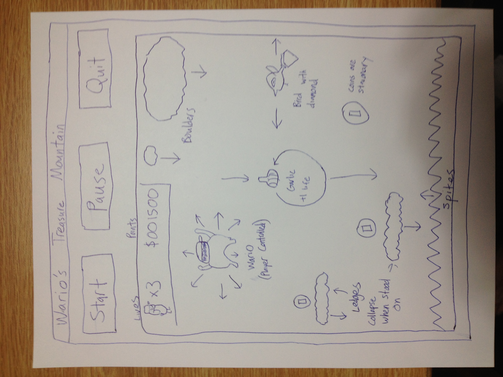

### Game Design Document

## Wario's Treasure Mountain

###Goal

Wario has heard of a huge treasure at the top of a mountain that is leaking coins and diamonds down below and resolves to get as much of the money as he can. The game mostly focuses on Wario climbing the side of the mountain trying to get all the coins on the screen to advance to the next level without getting hit by boulders or being skewered by the thieves below him trying to grab him with their spike machine and steal all his ill-gained money.

#### Game Objects

Boulders: Boulders are some of the main hazards in the game. They will instantiate at the very top of the screen and fall down towards the bottom at which point they vanish. There will be two or three different sizes of boulder which fall at different speeds. Both will kill wario.

Ledges: Ledges are horizontal areas of earth that stick out of the mountain wall that Wario climbs. ~~They will break Wario's fall and allow him to jump up to another ledge or to continue climbing. They are usually stationary but if Wario lands on one after 5 seconds it will begin collapsing and fall downwards off screen.~~ They now should just push the spikes down that rise up due to coding problems.

Birds: Birds will sporadically appear from the side of the screen and fly right or left while holding a diamond. If Wario makes contact with the bird it will fly up off the screen and Wario's money total will increase. Later Addition: Current beta only has the diamond image not the birds.

Garlic: Garlic cloves will sometimes fall from the sky with the boulders. Due to their innate magical power they will float in the middle of the screen moving in a ~~circle after they appear and then winking out of existence if they aren't touched.~~ zig zag pattern. They will add one life to Wario's number of lives if he catches one.

Spikes: A sea of spikes will appear ~~one minute~~ after the battle begins. It will continually move upwards until it reaches the top of the screen. If Wario touches the spikes he dies instantly making an essential time limit for each stage.

####Commands

The game is played using the keyboard. The arrow keys allow Wario when he is on the wall to move to the left, right, up and down or diagonal if two keys are clicked at the same time. When standing on a ledge pressing the space bar will have wario jump and pushing the up arrow key while jumping will make Wario resume climbing. 

#### Score

The player's score increases with every coin or diamond the player comes across. Each coin gives 100 points while a diamond gives 100 points. Completing a level by getting every single coin on the map also increases your points by 200 times the level number. 

~~Each time a player is hit by a small boulder they will lose 100 points as some of the coins are knocked from Wario's bag. ~~

####Lives

In the upper right of the screen will be a little image of wario with a number next to it showing how many lives the player has remaining. Each time the player 
is hit by a large boulder, comes into contact with the sea of spikes, or goes below the screen due to falling from being hit by a small boulder they will lose a life. Extra lives will be granted every 20000 points as Wario buys a new stunt double.

### Layout

The start, pause, and quit buttons are in the file menu. 

Initial screen is blank just with a large text box telling the title and the controls which upon pushing start switches to the actual game.

Will also have a text box where the user will put their name which will display to the right of the score.

Pause will put the word PAUSE across the game screen and lock all movement in the scene.

The lives and point numbers are in a small box in the top left that wario cannot move into.

Example of layout, "things" images and direction of movement for the things.

